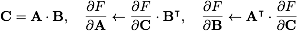
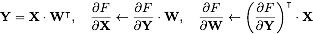

## Preface 

This document explains how KANN is implemented and some philosophies behind the
design. Importantly, the methods described here are only one way to implement
a deep learning framework from scratch. They are not necessarily the optimal
way. Please take the words below with a grain of salt.


## Table of Contents

* [Basic Concepts](#basic-concepts)
  - [N-dimensional array](#n-dimensional-array)
  - [Automatic differentiation and computational graph](#automatic-differentiation-and-computational-graph)
  - [Backpropagating matrix products](#backpropagating-matrix-products)
  - [Network layers](#network-layers)
* [Implementing Convolution](#implementing-convolution)
  - [Definition of convolution](#definition-of-convolution)
  - [The shape of n-d arrays](#the-shape-of-n-d-arrays)
  - [Implementing the convolution operation](#implementing-the-convolution-operation)
* [Implementing Recurrent Neural Network (RNN)](#implementing-recurrent-neural-network-rnn)
  - [Computational graph of RNN](#computational-graph-of-rnn)
  - [Unrolling RNN](#unrolling-rnn)


## Basic Concepts

### N-dimensional array

N-dimensional array, or n-d array in brief, is a fundamental object that holds
most types of numerical data in KANN. It can be described with the following
struct:
```cpp
typedef struct {
    int n_d;   // number of dimensions
    int *d;    // dimensions, of size n_d
    float *x;  // array data, of size \prod_i{d[i]} (1 if n_d==0)
} NDArray_t;
```
The dimensions are also called the *shape* of the array. Conventionally, we
call the n-d array a scalar if *n\_d* equals 0, a vector if *n\_d* equals 1 and
a matrix if *n\_d* equals 2. We note that deep learning frameworks often take
n-d array as a synonym of *tensor*, though according to [wiki][tensor-wiki],
this seems imprecise.

### Automatic differentiation and computational graph

[Automatic differentiation][ad] is the backbone of several major deep learning
frameworks. It efficiently computes the gradient of a function without symbolic
derivation. Automatic differentiation is typically achieved with a graph which
is loosely called as a computational graph or a data flow graph (as in
TensorFlow). Detailed description of automatic differentiation is beyond the
scope of this note. We will only show an example here:


A generic computational graph only distinguishes differentiable variables and
non-differentiable parameters or constants. It does not have a concept of
input, truth output, cost, hyperparameter and so on. KANN gives a node a
specific meaning by putting one label on the node. A KANN model is a labeled
computational graph.

The example here demonstrates the so-called symbol-to-number differentiation.
[TensorFlow][tf] and [Theano][theano] use symbol-to-symbol differentiation
by augmenting the computational graph with derivative nodes. We refer to the
[Deep Learning book][dlbook] for details.

### Backpropagating matrix products

In implementation, each node in a computational graph holds an n-d array. An
important operation between two 2D arrays is [matrix product][matmul]. If we
let the shape of the gradient take the same shape as the variable, we can
backpropagate gradients with:
<!--
{\bf C}={\bf A}\cdot{\bf B},
\hspace{1em}\frac{\partial F}{\partial {\bf A}}\gets\frac{\partial F}{\partial {\bf C}}\cdot {\bf B}^\intercal,
\hspace{1em}\frac{\partial F}{\partial {\bf B}}\gets{\bf A}^\intercal\cdot\frac{\partial F}{\partial {\bf C}}
-->


As we see here, gradients update also involes matrix product and thus can be
calculated with the GEMM routine from [BLAS][blas]. KANN more often uses matrix
product with the second matrix transposed. The backprop rule becomes:
<!--
{\bf Y}={\bf X}\cdot{\bf W}^\intercal,
\hspace{1em}\frac{\partial F}{\partial {\bf X}}\gets\frac{\partial F}{\partial {\bf Y}}\cdot {\bf W},
\hspace{1em}\frac{\partial F}{\partial {\bf W}}\gets\left(\frac{\partial F}{\partial {\bf Y}}\right)^\intercal\cdot{\bf X}
-->


### Network layers

In the context of computational graph, a layer is a well-defined reusable
subgraph. The following figure shows the computational graph of a [multilayer
perceptron][mlp] with one hidden layer:


In this figure, each dotted red box represents a dense (aka fully connected)
layer that has one input (in green) and one output (in blue). In KANN, a layer
works exactly this way.


## Implementing Convolution

### Definition of convolution

We often see two ways to define convolution in the context of deep learning:
with or without the weight matrix flipped. Both ways work in practice and are
used in mainstream frameworks. KANN uses flipped weight matrices as this is
closer to the mathematical definition of convolution.

### The shape of n-d arrays

For 2D convolution, cuDNN and Theano take images in shape of
(batch-size,in-channel,height,width) and convolution weights in shape of
(out-channel,in-channel,kernel-height,kernel-width). KANN follows the cuDNN and
Theano convention. Caffe and TensorFlow are different. They take images in
shape of (batch-size,height,weight,in-channel) and weights in
(kernel-height,kernel-width,in-channel,out-channel).

### Implementing the convolution operation

Loosely speaking, there are three ways to implement the convolution operation.
The first way is direct computation. It takes little working space but is
usually slow especially for small kernels. In major frameworks, the most common
way seems to convert convolution to a matrix multiplication problem by
duplicating and expanding the input and weight matricies. A good visual
explanation can be found in the [cuDNN paper][cudnn]. A C++ implementation of
the core routine `im2col` can be found [in the Caffe source code][im2col].
This second approach is much faster than a naive direct implementation. A
drawback is it may require significant more working space for large kernels.
Finally, as convolution is closely related to Fourier transformation, the
convolution operation can also be implemented with Fast Fourier Transformation
(FFT). [NNPACK][nnpack] gives an efficient CPU-only implementation.

KANN uses direct computation with an optimized inner loop. On a machine we use,
it is eight times faster than a naive implementation, but about twice as slow
as a CPU-only Theano implementation which is based on matrix product. KANN
provides a reasonably fast, though not very fast, implementation that is still
simple and does not require a lot of working space.

As a side note, the performance of CPU-only Theano and TensorFlow may vary
greatly depending on how they are installed. We found a [Conda][conda]
installation is usually the easiest and most efficient. The Theano website
[provides instructions][theano-install] on optimized installation which also
works well if we have the root privilege. At our hand, a `pip` installation
without efficient BLAS preinstalled is fairly slow, potentially because Theano
is calling BLAS routines through NumPy.


## Implementing Recurrent Neural Network (RNN)

There are usually two ways to implement an RNN. First, we may unroll the RNN to
a feed-forward network (FNN) and then apply the same FNN algorithm for
training. Second, we may keep the history of values and derivatives at each
node without unrolling and then traverse the history backwardly to calculate
the gradients. KANN takes the first approach for training as we thought this
might be easier to implement. Many other deep learning libraries take the
second or both approaches. For prediction, as we do not need to keep the
history of computation, both approaches are equally easy to implement in KANN.

### Computational graph of RNN

The following figure shows the computational graph of a vanilla RNN where
"Dense layer" is a red dotted box in the [MLP figure](images/mlp.png).


This graph differs from typical feedforward graphs in two aspects: the presence
of the backward link (in green) and a pooling node (in blue). The backward link
indicates where is recurrence. In the source code, the `kad_node_t::pre`
pointer in [kautodiff.h](../kautodiff.h) implements such a link. The pooling
node specifies where data at different time steps should be pooled together.
The figure above pools the cost at each step. It is typically used when the
output is also a sequence (e.g. for text generation). Another typical use case
is to put the pooling node right above the "Dense layer". In this case, the
network output is not a sequence. We may use such a network, for example, to
classify music.

Computational graphs of LSTM and GRU networks are similar, except that the red
dotted box becomes more complex.

### Unrolling RNN

The following figure shows an FNN by unrolling the RNN twice:


The green edge represents the backward link in the previous figure. This FNN
takes (*x1*,*x2*) as input and (*y1*,*y2*) as truth output.

Generally, to unroll an RNN to a certain length, we first duplicate internal
nodes and input/output nodes "below" the (possibly multiple) pooling nodes and
connect different time steps following the backward links. As other external
nodes are not duplicated, we also need to adjust the children of some
duplicated nodes.  We then pool the duplicated descendents of the pooling nodes
and finally copy over the nodes "above" the pooling nodes. Another way to
understand the unrolling algorithm is to simulate forward data flows in the
original RNN graph.  We add a node to the unrolled graph when the data flow
visits the node; we add a pooling node when all its duplicated descendants have
been computed; we copy over the rest of nodes when all pooling nodes have been
computed.


[tensor-wiki]: https://en.wikipedia.org/wiki/Tensor
[tf]: https://www.tensorflow.org
[theano]: http://deeplearning.net/software/theano/
[ad]: https://en.wikipedia.org/wiki/Automatic_differentiation
[mlp]: https://en.wikipedia.org/wiki/Multilayer_perceptron
[rnnjs]: https://github.com/karpathy/recurrentjs
[matmul]: https://en.wikipedia.org/wiki/Matrix_multiplication
[blas]: https://en.wikipedia.org/wiki/Basic_Linear_Algebra_Subprograms
[dlbook]: http://www.deeplearningbook.org
[cudnn]: https://arxiv.org/abs/1410.0759
[im2col]: https://github.com/BVLC/caffe/blob/master/src/caffe/util/im2col.cpp
[nnpack]: https://github.com/Maratyszcza/NNPACK
[conda]: http://conda.pydata.org/docs/using/pkgs.html
[theano-install]: http://deeplearning.net/software/theano/install_ubuntu.html
